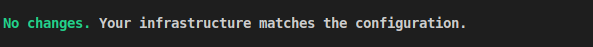

# Infrastructure that I own, managed in Terraform

This is a "showcase" of my web infrastructure, defined using Terraform.

I use DigitalOcean as my cloud provider, and I use their VM hosting ("droplets"), domain management, and managed app service.

I store this state in a AWS S3 bucket. I would have used DigitalOcean's Spaces, which have an identical API to AWS, but it would've ended up a lot more expensive for such a small task.

Why DigitalOcean? I find it easier to manage than AWS. It has fewer things moving around, fewer things to go wrong and pricing is easy and clear. That being said, I enjoyed debugging AWS IAM permissions for two days to setup the state bucket.

